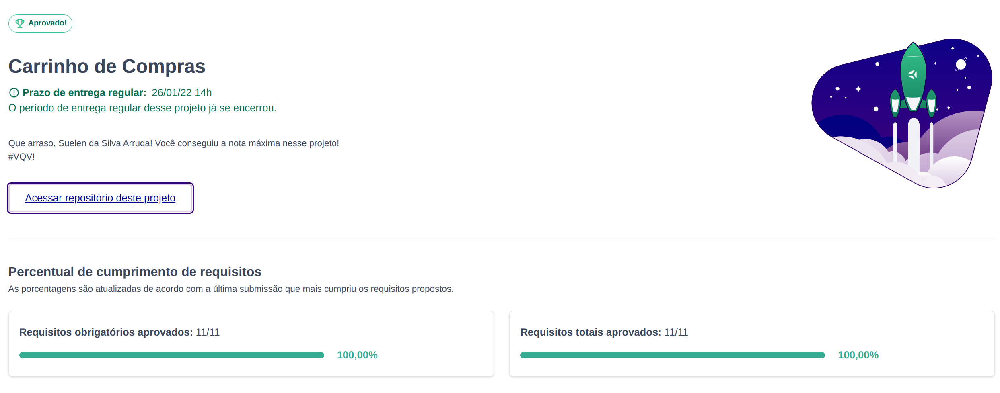

# Shopping Cart Project  

Neste projeto de final de módulo construímos uma aplicação que simula um carrinho de ecommerce, de onde é possível adicionar e remover itens 

---

## Habilidades Desenvolvidas

- Fazer requisições a uma API *(Application Programming Interface)* do Mercado Livre;
- Utilizar os seus conhecimentos sobre JavaScript, CSS e HTML;
- Trabalhar com funções assíncronas;
- Implementar testes unitários.

---

## Stack utilizada

  
  
 

---

### Protótipo do projeto fornecido pela Trybe

Seu projeto deve ter o comportamento parecido com o do gif abaixo quando finalizado, **não se preocupe em replicar o visual, o gif so ilustra o comportamento**:

---

### Gif do Projeto finalizado

### Status do Projeto 

---

